# Rozwiązywanie konfliktów:

### 1. Create the file: "conflict_challenge.txt", fill it with 1000 words of "lorem ipsum" and push it to the main branch.

### 2. Create 2 new branches: conflict_1 and conflict_2.

### 3. Checkout conflict_1 branch.

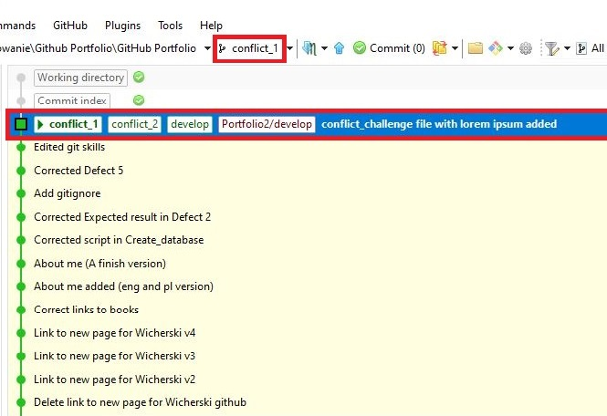

### 4. Replace the content of the file with the first 8 paragraphs from: https://literat.ug.edu.pl/dziady/003.

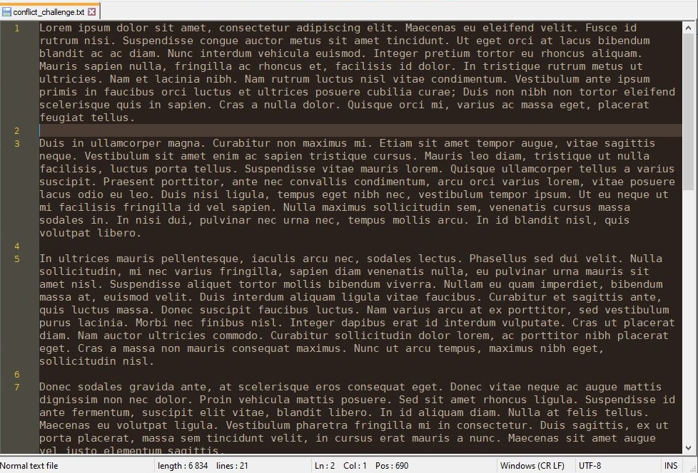

### 5. Push the changes (to the same branch).

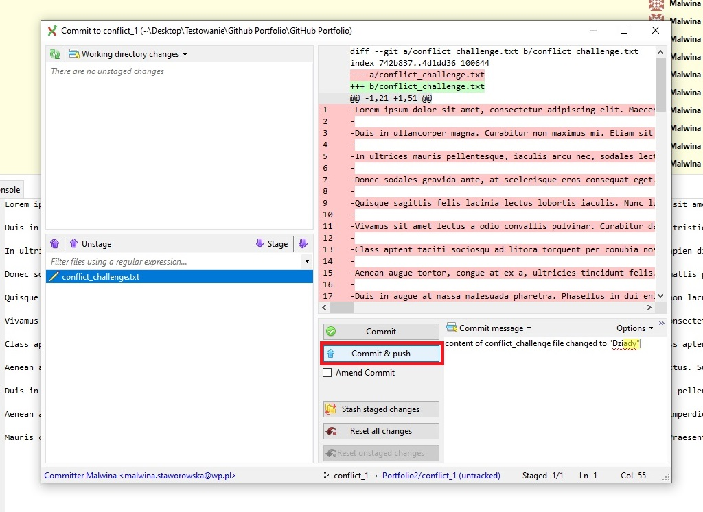

### 6. Checkout conflict_2 branch.

### 7. Do the same as in step 4, but in English.

### 8. Push the changes.

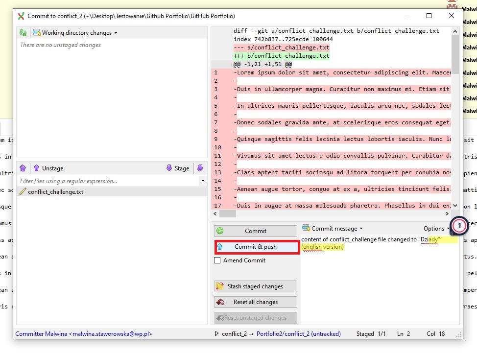

### 9. Merge the changes from conflict_1 branch to conflict_2 and resolve conflicts.

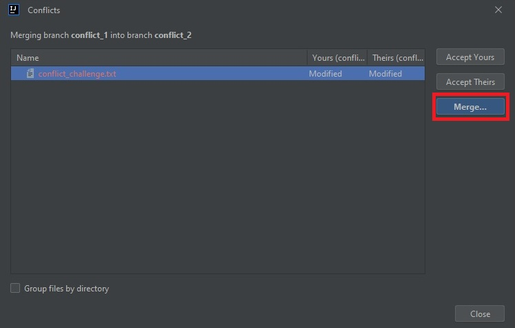

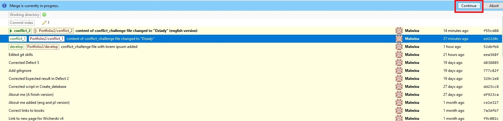

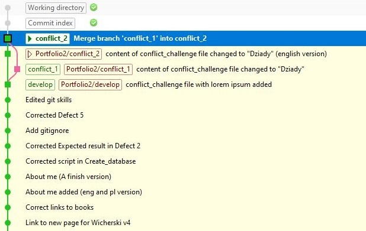

### 10. Push the resolved conflicts to conflict_2 branch.

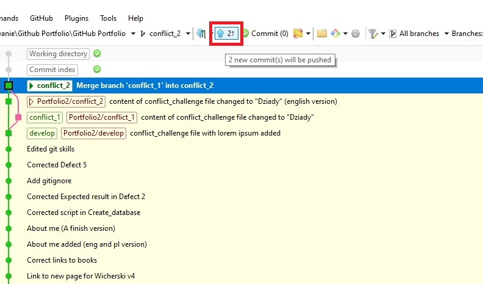

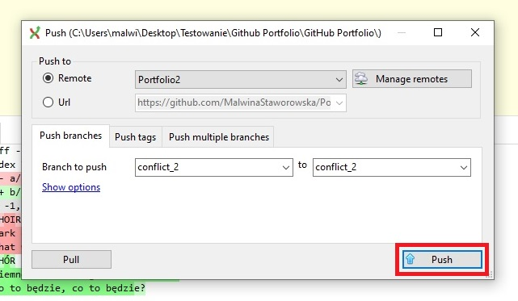

### 11. Merge conflict_2 branch to conflict_1 branch.

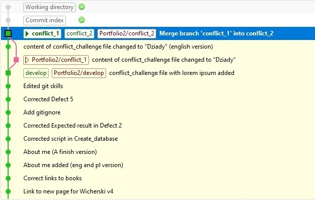

### 12. Push conflict_1 branch.

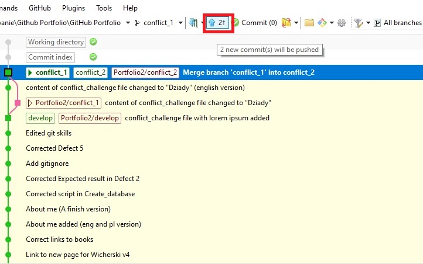

### 13. Delete conflict_2 branch.

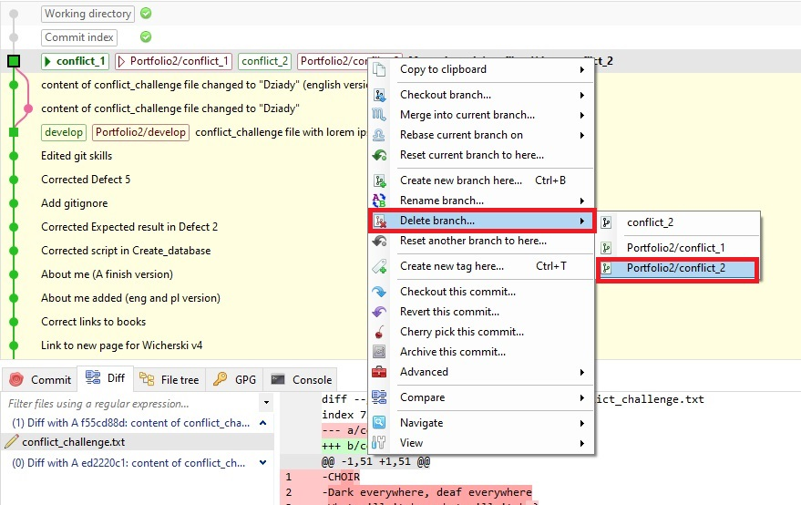

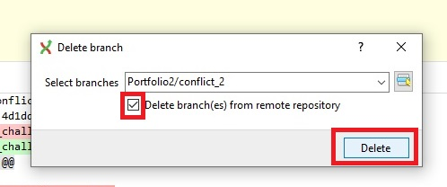

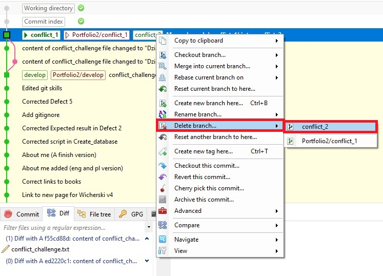

