# Rozwiązywanie konfliktów:

### 1. stwórz plik: "conflict_challenge.txt" wypełnij go "lorem ipsum" na 1000 słów i wypchnij go na główny branch.

### 2. zrób 2 nowe branche: conflict_1 i conflict_2

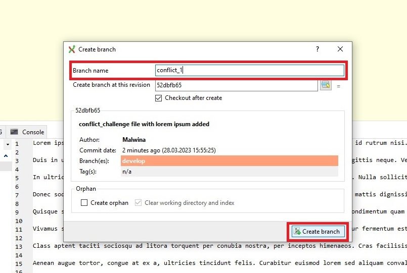

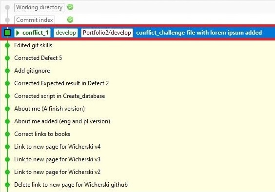

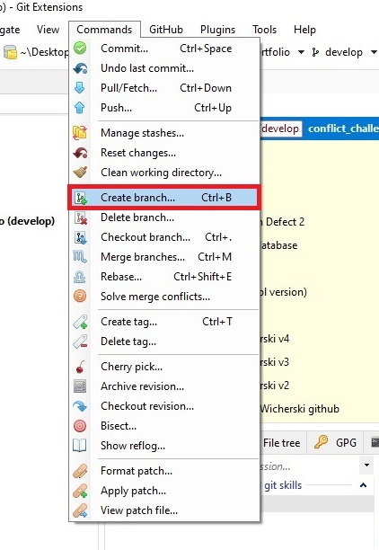

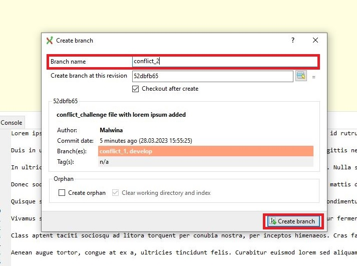

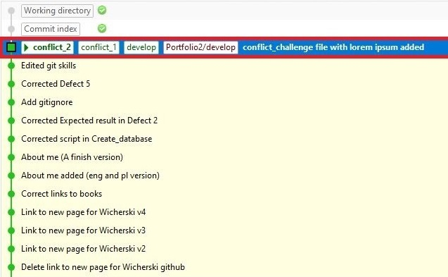

### 3. przejdź na branch conflict_1

### 4. zamień treść pliku na pierwsze 8 akapitów z: https://literat.ug.edu.pl/dziady/003

### 5. wypchnij zmiany (na ten sam branch)

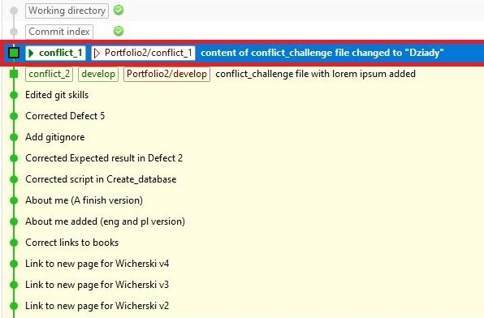

### 6. przejdź na branch conflict_2

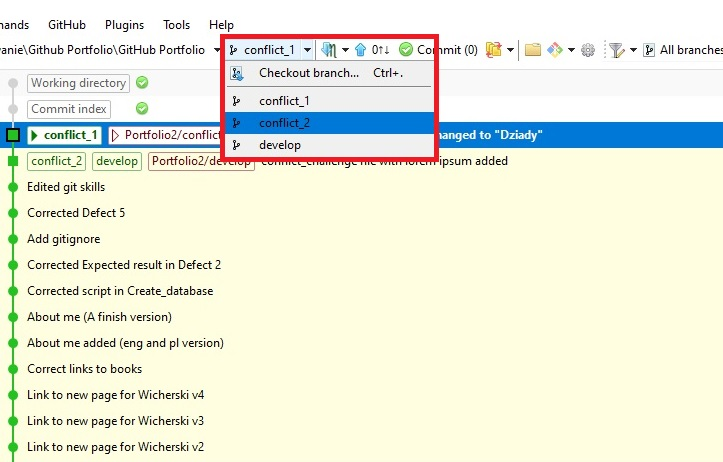

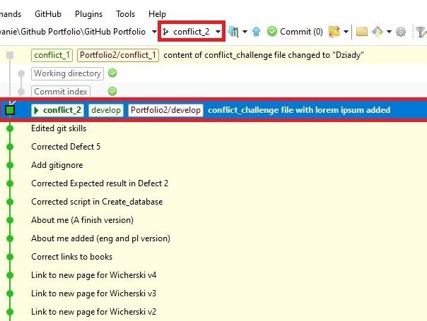

### 7. zrób to samo co w punkcie 4., ale po angielsku

### 8. wypchnij zmiany

### 9. domerguj zmiany z brancha conflict_1 do conflict_2 i rozwiąż konflikty

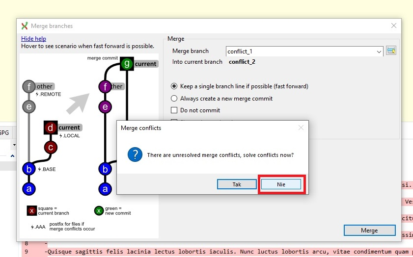

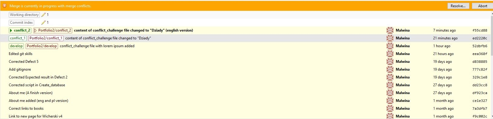

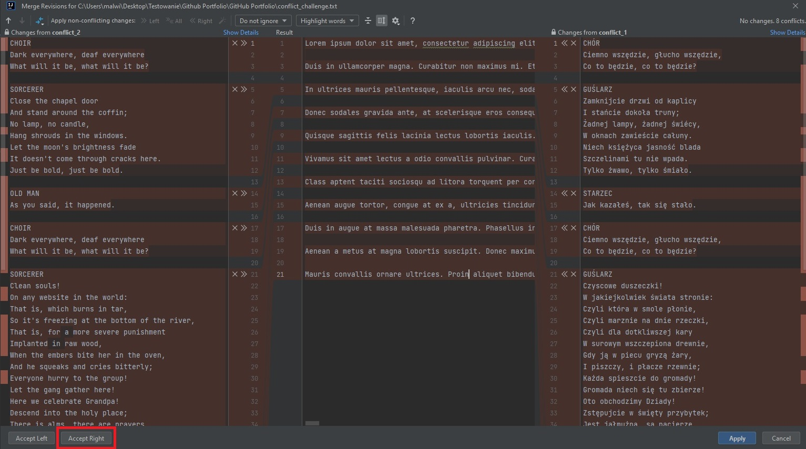

### 10. wypchnij rozwiązane konflikty na branchu conflict_2

### 11. domergeuj branch conflict_2 do brancha conflict_1

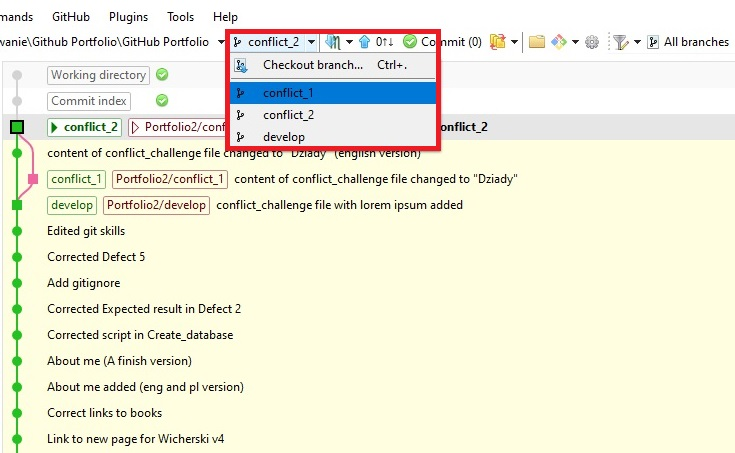

### 12. wypchnij branch conflict_1

### 13. skasuj branch conflict_2

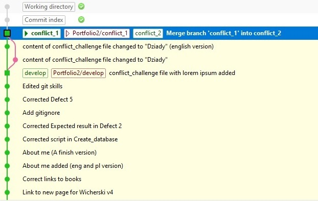

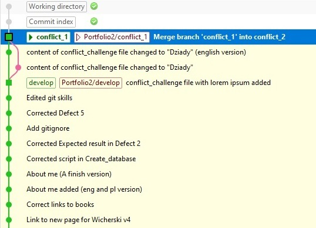
