# Resolving Git conflicts:

### 1. Create the file: "conflict_challenge.txt", fill it with 1000 words of "lorem ipsum" and push it to the main branch.

I created in my local repository a conflict_challenge.txt file in Notepad++ and I filled it lorem ipsum. 
To push it to the main branch on my remote repository in GitHub I used GitExtensions. 
At first, I clicked the *Commit* button, and then I filled in the *Commit message* field and clicked
the *Commit & push* button.

### 2. Create 2 new branches: conflict_1 and conflict_2.

To create the first branch I clicked the *Commands* tab and chose *Create branch...* from the list. Then I filled in the
*Branch name* field and clicked the *Create branch* button. Then I repeated the whole process for the second branch.

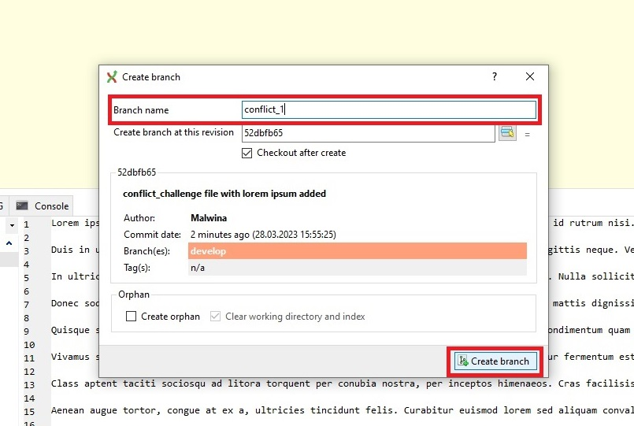

### 3. Checkout conflict_1 branch.

At this moment I was on conflict_2 branch. To checkout conflict_1 branch I clicked a select box in the top bar with
the name of my current branch and chose *conflict_1* from the list.

### 4. Replace the content of the file with the first 8 paragraphs from: https://literat.ug.edu.pl/dziady/003.

In my local repository, I replaced lorem ipsum in the conflict_challenge.txt file with the first 8 paragraphs from the "Dziady"
book.

### 5. Push the changes (to the same branch).

In Git Extensions I clicked the *Commit* button, and then I filled in the *Commit message* field and clicked the *Commit & push* button.

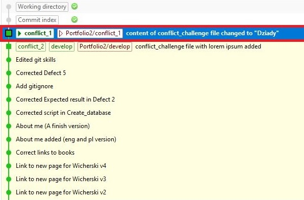

### 6. Checkout conflict_2 branch.

At this moment I was on conflict_1 branch. To checkout conflict_2 branch I clicked the select box in the top bar with
the name of my current branch and chose *conflict_2* from the list.

### 7. Do the same as in step 4 but in English.

In my local repository, I replaced lorem ipsum in the conflict_challenge.txt file with the first 8 paragraphs from the "Dziady"
book but in the English version.

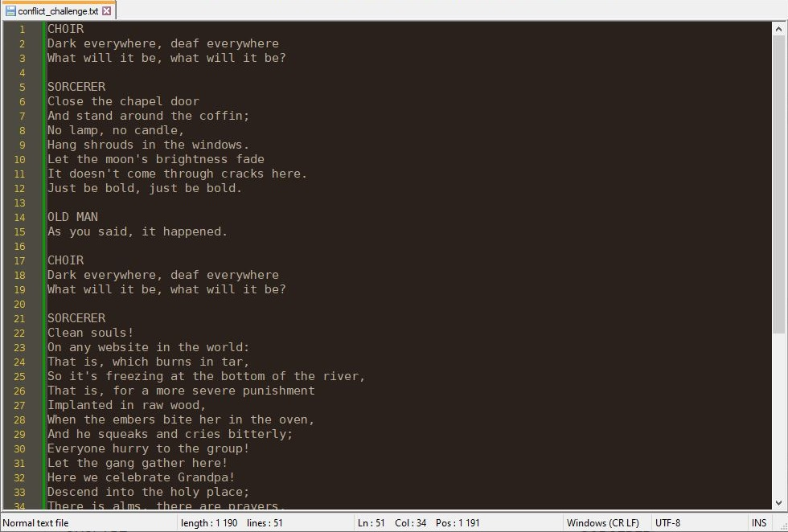

### 8. Push the changes.

In Git Extensions I clicked the *Commit* button, and then I filled in the *Commit message* field and clicked
the *Commit & push* button.

### 9. Merge the changes from conflict_1 branch to conflict_2 and resolve conflicts.

At this moment I was on conflict_2 branch. To merge the changes from conflict_1 branch to conflict_2, in Git Extensions
I clicked the right mouse button on the conflict_1 branch, then chose *Merge into current branch...* and clicked *conflict_1*.
Next, I chose *Merge branch* from the list and clicked the *Merge* button. At this moment I had unresolved merge conflicts. 
To resolve them I used IntelliJ IDEA. In IntelliJ, I clicked the *Git* tab and then *Resolve conflicts...*. I chose a file
with merge conflicts and decided which version of the file I want. Then I went back to Git Extensions and clicked
*Continue* next to the text: *Merge is currently in progress*.

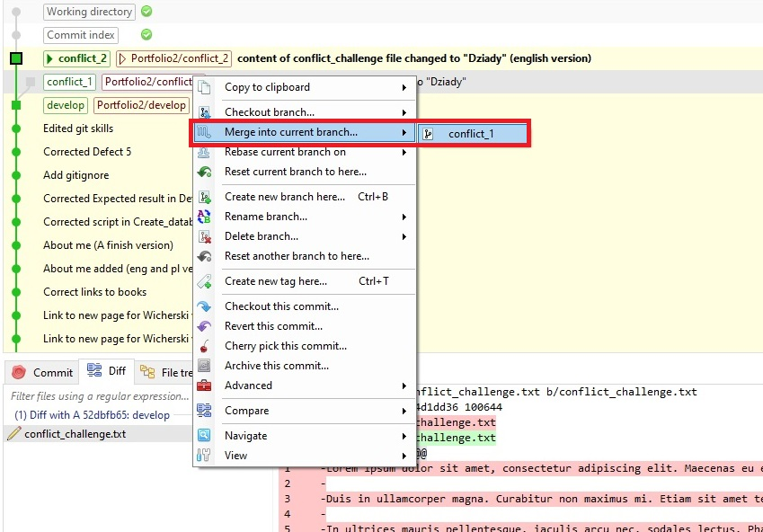

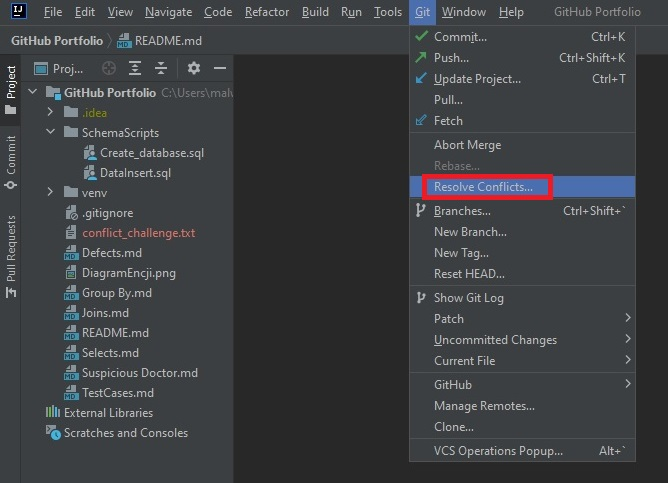

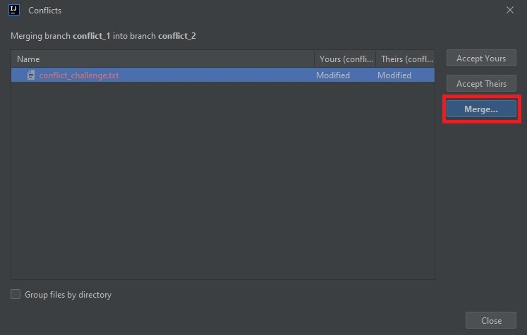

### 10. Push the resolved conflicts to conflict_2 branch.

To only push the resolved conflicts I clicked the up arrow button in the top bar and then the *Push* button.

### 11. Merge conflict_2 branch to conflict_1 branch.

At this moment I was on conflict_2 branch. To merge conflict_2 branch to conflict_1 branch I had to change the branch on
conflict_1. Then I clicked the right mouse button on conflict_2 branch, then chose *Merge into current branch...*, and clicked *conflict_2*. Next, I chose *Merge branch* from the list and clicked the *Merge* button.

### 12. Push conflict_1 branch.

To push I clicked the up arrow button in the top bar and then the *Push* button.

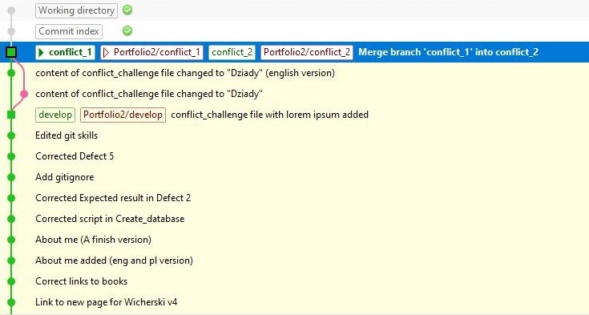

### 13. Delete conflict_2 branch.

To delete conflict_2 branch, at first I had to delete files from the local and remote repositories. To delete files from the
remote repository on GitHub I clicked the right mouse button on conflict_2 branch, then chose *Delete branch...* and clicked *Portfolio2/conflict_2*. 
To delete files from the local repository I clicked the right mouse button again on conflict_2 branch then chose *Delete branch...* and clicked *conflict_2*. 

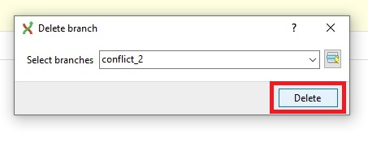

# .gitignore file editing

### 1. Checkout a main branch.

To checkout branch, I clicked the select box in the top bar with the name of my current branch
and chose *develop* from the list.

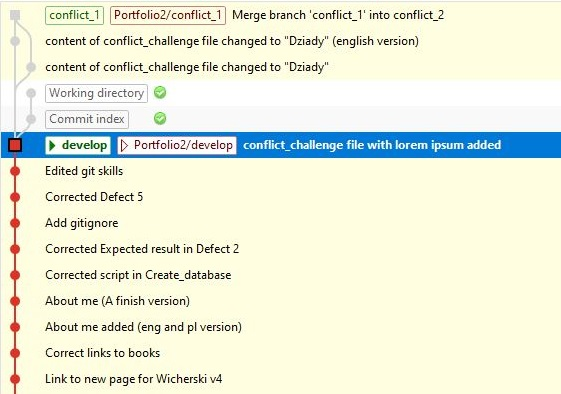

### 2. Create a "some_file.dat" file in your local repository.

I created the some_file.dat file in Notepad++.

### 3. Set ignoring this file in Git.

In Git Extensions I clicked the *Repository* tab and clicked *Edit .gitignore*. Then in the text field, I wrote *some_file.dat*
and clicked the *Save* button.

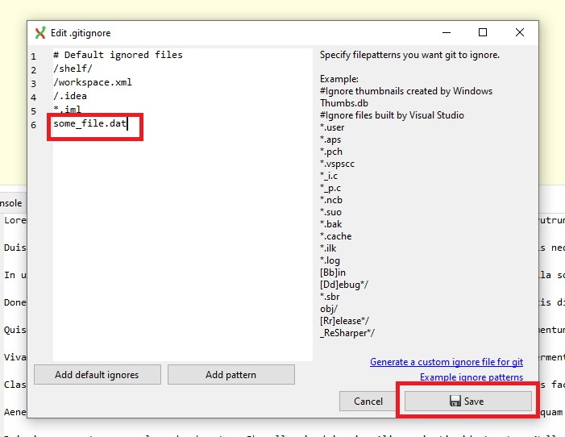

### 4. Push the changes.

To push the changes I clicked the *Commit* button in the top bar, then I filled in the *Commit message* field
and clicked the *Commit & push* button.

### 5. Create a "my_project" directory in your local repository.

I created the my_project directory.

### 6. Inside this directory create a few files and a "build" directory.

Inside the my_project directory, I created the file1.txt and file2.txt files and the build directory.

### 7. In the "build" directory add the next files.

In the build directory, I created the fileInBuild1.txt, fileInBuild2.txt and fileInBuild3.txt files.

### 8. Set ignoring the content of the "build" folder in Git.

In Git Extensions I clicked the *Repository* tab and clicked *Edit .gitignore*. Then in the text field, I wrote
*/my_project/build* and clicked the *Save* button.

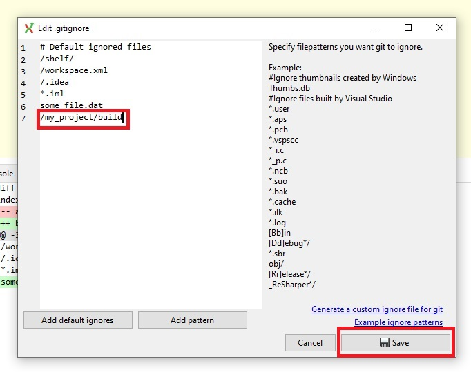

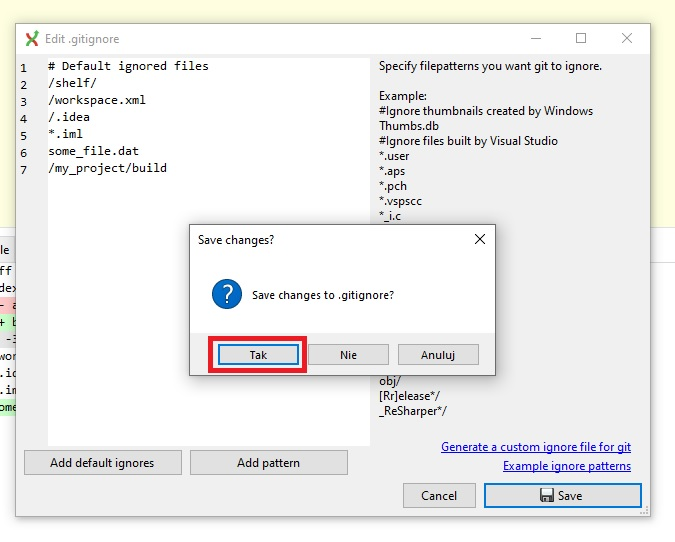

### 9. Push the changes.

To push the changes I clicked the *Commit* button in the top bar, then I filled in the *Commit message* field
and clicked the *Commit & push* button.

