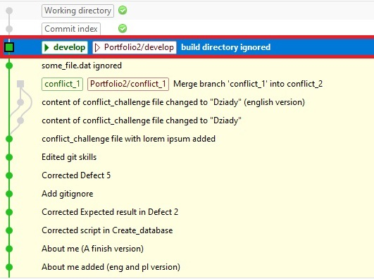

# .gitignore file editing

### 0. przejdź na branch główny
1. Checkout a main branch.

To checkout branch I clicked a button (?) in the top bar with the name of my current branch 
and chose *develop* from the list.

### 1. zrób w repozytorium plik "some_file.dat"
2. Create a "some_file.dat" file in your local repository.

I created *some_file.dat* file in notepad++. <- potrzebny opis do tego podpunktu????

### 2. ustaw ignorowanie w gicie w taki sposób, by ten plik się nie wypchnął
3. Set ignoring this file in Git.

In Git Extensions I clicked *Repository* tab and clicked *Edit .gitignore*. Then in text field I wrote *some_file.dat*
and clicked *Save* button.

### 3. wypchnij zmiany jeśli zadziałało ignorowanie
4. Push the changes. / Push the changes if ignoring worked.
   
   To push the changes I clicked *Commit* button in the top bar, then I filled *Commit message* field 
   and clicked *Commit & push* button.

### 4. zrób folder o nazwie: "my_project"
5. Create a "my_project" directory in your local repository.

I created a *my_project* directory <- potrzebny opis do tego podpunktu?

### 5. w środku tego folderu zrób kilka plików (jakie chcesz), oraz folder "build"
6. Inside this directory create a few files and a "build" directory.

Inside *my_project* directory I created *file1.txt* and *file2.txt* files and *build* directory.

### 6. w folderze "build" dodaj kolejne losowe pliki
7. In the "build" directory add the next files.

In the *build* directory I created *fileInBuild1.txt*, *fileInBuild2.txt* and *fileInBuild3.txt* files.

### 7. ustaw ignorowanie w gicie w taki sposób, by zawartość folderu (build) się nie wypchnęła
8. Set ignoring the content of the "build" folder in Git.

In Git Extensions I clicked *Repository* tab and clicked *Edit .gitignore*. Then in text field I wrote 
*/my_project/build* and clicked *Save* button.

### 8. wypchnij zmiany jeśli zadziałało ignorowanie.
9. Push the changes. / Push the changes if ignoring worked.

To push the changes I clicked *Commit* button in the top bar, then I filled *Commit message* field
and clicked *Commit & push* button.

