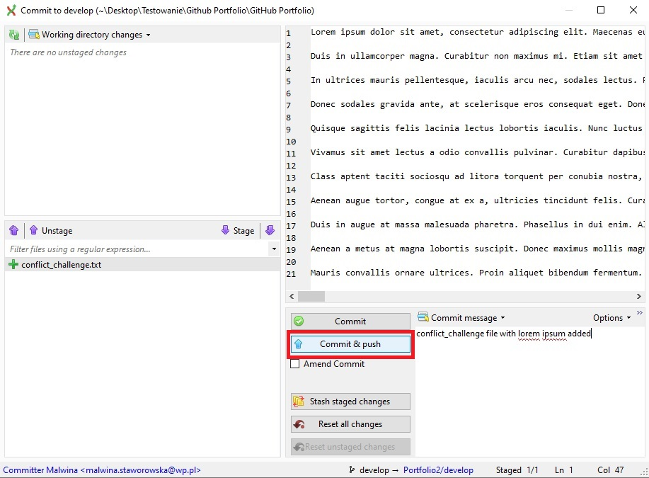
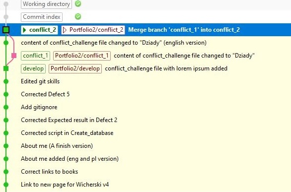
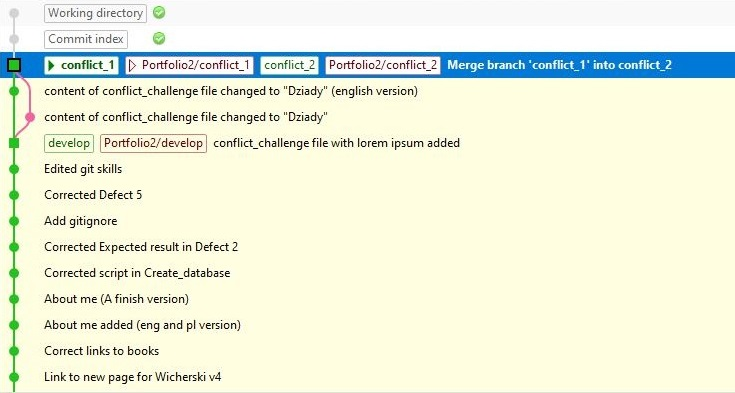

# Resolving Git conflicts:

### 1. Create the file: "conflict_challenge.txt", fill it with 1000 words of "lorem ipsum" and push it to the main branch.

I created in my local repository a conflict_challenge.txt file in notepad++ and I filled it lorem ipsum. 
To push it to the main branch on my remote repository in GitHub I used GitExtensions. 
At first, I clicked *Commit* button, and then I filled *Commit message* field and clicked
the *Commit & push* button.

### 2. Create 2 new branches: conflict_1 and conflict_2.

To create the first branch I clicked *Commands* tab and chose *Create branch...* from the list. Then I filled 
*Branch name* field and clicked *Create branch* button. Then I repeated the whole process for the second branch.

### 3. Checkout conflict_1 branch.

At this moment I was on conflict_2 branch. To checkout conflict_1 branch I clicked a button (?) in the top bar with
the name of my current branch and chose *conflict_1* from the list.

### 4. Replace the content of the file with the first 8 paragraphs from: https://literat.ug.edu.pl/dziady/003.

In my local repository I replaced lorem ipsum in the conflict_challenge.txt file with the first 8 paragraphs from Dziady
book.

### 5. Push the changes (to the same branch).

In Git Extensions I clicked *Commit* button, and then I filled *Commit message* field and clicked *Commit & push* button.

### 6. Checkout conflict_2 branch.

At this moment I was on conflict_1 branch. To checkout conflict_2 branch I clicked a button (?) in the top bar with
the name of my current branch and chose *conflict_2* from the list.

### 7. Do the same as in step 4, but in English.

In my local repository I replaced lorem ipsum in the conflict_challenge.txt file with the first 8 paragraphs from Dziady
book but in English version.

### 8. Push the changes.

In Git Extensions I clicked *Commit* button, and then I filled *Commit message* field and clicked
the *Commit & push* button.

### 9. Merge the changes from conflict_1 branch to conflict_2 and resolve conflicts.

At this moment I was on conflict_2 branch. To merge the changes from conflict_1 branch to conflict_2, in Git Extensions
I clicked right mouse button on the conflict_1 branch, then chose *Merge into current branch...* and clicked *conflict_1*.
Next I filled *Merge branch* field and clicked *Merge* button. At this moment I had unresolved merge conflicts. To resolve
them I used IntelliJ IDEA. In IntelliJ I clicked *Git* tab and then *Resolve conflicts...*. I chose file
with merge conflicts and decided which version of file I want. Then I went back to Git Extensions and clicked
*Continue* next to the text: *Merge is currently in progress*.

### 10. Push the resolved conflicts to conflict_2 branch.

To only push the resolved conflicts I clicked up arrow button in the top bar and then *Push* button.

### 11. Merge conflict_2 branch to conflict_1 branch.

At this moment I was on conflict_2 branch. To merge conflict_2 branch to conflict_1 branch I had to change branch on
conflict_1. Then I clicked right mouse button on conflict_2 branch, then chose *Merge into current branch...* and 
clicked *conflict_2*. Next I filled *Merge branch* field and clicked *Merge* button.

### 12. Push conflict_1 branch.

To push I clicked up arrow button in the top bar and then *Push* button.

### 13. Delete conflict_2 branch.

To delete conflict_2 branch, at first I had to deleted files from the local and remote repository. To delete files from the
remote repository on GitHub I clicked right mouse button on conflict_2 branch, then chose *Delete branch...* and 
clicked *Portfolio2/conflict_2*. To delete files from the local repository I again clicked right mouse button 
on conflict_2 branch, then chose *Delete branch...* and clicked *conflict_2*. 

